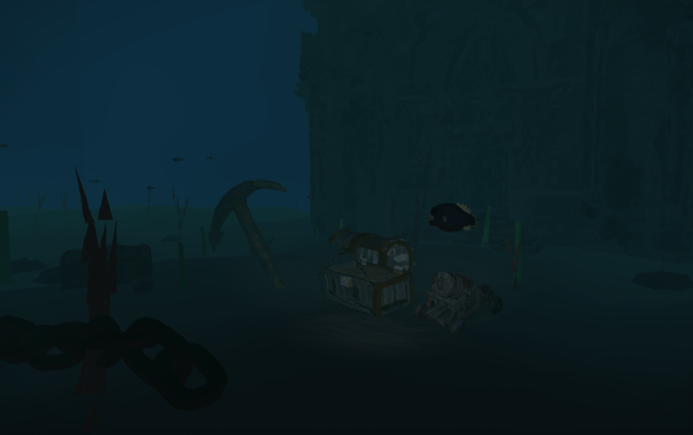
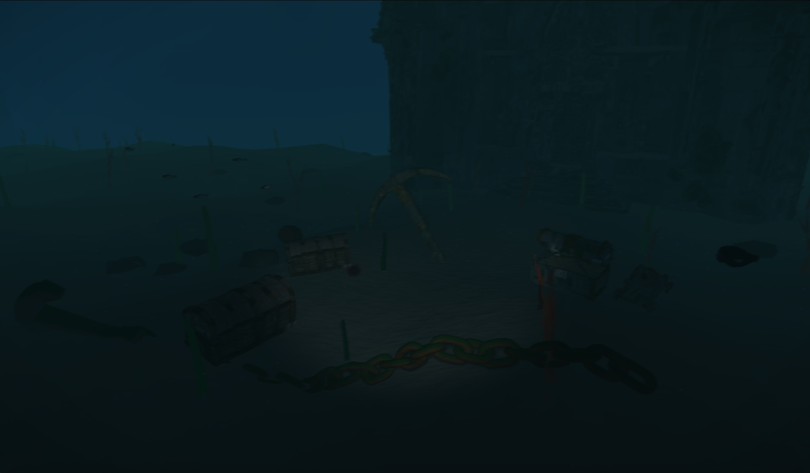
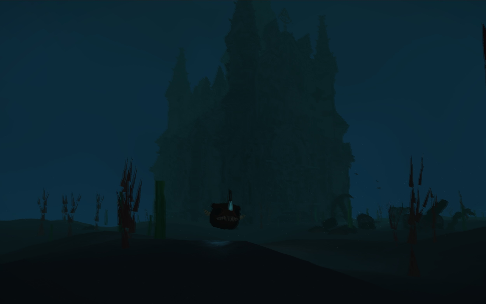

# Bathyscaphe — Deep Underwater Scene

Interactive underwater OpenGL 3.3 application (C++ / GLSL). View from a bathyscaphe interior toward a dark seabed with sand, corals, kelp, animated fish, GLB props, submarine headlights, and flow-map underwater distortion.

**Team members:** Mikhail Romanov, Tamara Dutka, Hanna Eivazava gr. 13
Repository: https://github.com/ttoma-v/project-grafika-komputerowa.git

## Implemented methods

| Method | Where in project |
|--------|------------------|
| **Quaternion camera** | `src/Camera.cpp` |
| **Underwater skybox / cubemap** | `Texture.cpp`, `assets/shaders/skybox.*` |
| **PBR lighting** (metallic/roughness, Cook-Torrance) | `assets/shaders/pbr.frag` |
| **Normal mapping** (TBN, sand + coral materials) | `pbr.vert`, `pbr.frag`, `Texture.cpp` |
| **Shadow mapping** (depth bias + 3×3 PCF) | `shadow_depth.*`, `pbr.frag`, `main.cpp` |
| **Parallel Transport Frames** (fish swim paths + kelp splines) | `src/PTF.cpp`, `Geometry.cpp`, `main.cpp` |
| **A14 — Flow-map distortion** | `screen.frag`, `ProceduralTextures::makeFlowMap()`, offscreen FBO in `main.cpp` |
| **B13 — Moving point lights** | Camera headlights + lure light in `main.cpp` |

### Selected combination details

* **A14 (Flow-map current distortion):** Implemented as a full-screen post-processing pass (`screen.frag`). The entire 3D scene is rendered into an offscreen FBO, and then sampled with UV coordinates offset over time via a procedural 2D flow vector texture (`ProceduralTextures::makeFlowMap()`).
* **B13 (Moving point lights):** Driven by per-frame CPU updates in `main.cpp`. Includes two sweeping spotlights attached to the camera (bathyscaphe headlights) and one dynamic point light attached to the animated Anglerfish lure (`sin(time)` intensity modulation).

## Build

```bash
cmake -S . -B build
cmake --build build --config Release
```

Windows:

```bash
build\Release\underwater_bathy.exe
```

### macOS

The Windows `.exe` will not run on Mac — build locally from the same repository.

**Requirements:** Xcode Command Line Tools (`xcode-select --install`), CMake (`brew install cmake`), Git, internet on first configure (CMake fetches GLFW, GLM, cgltf, stb).

```bash
cd path/to/project-grafika-komputerowa
cmake -S . -B build
cmake --build build --config Release
./build/underwater_bathy
```

Run from the directory where CMake copied `assets/` (usually `build/`). On first start the console should print **Shaders OK**.

Optional Xcode generator:

```bash
cmake -S . -B build -G Xcode
cmake --build build --config Release
./build/Release/underwater_bathy
```

## Controls

| Key | Action |
|-----|--------|
| W / A / S / D | Move forward / left / back / right |
| Space | Move up |
| Left Shift | Move down |
| Mouse | Look around (quaternion camera) |
| **F** | Toggle bathyscaphe headlights on/off |
| **[** | Decrease underwater fog density |
| **]** | Increase underwater fog density |
| **G** | Cycle flow distortion: off → normal (0.003) → strong (0.006) |
| **T** | Toggle shadow mapping on/off |
| Esc | Quit |

## Scene

- **100×100** procedural seabed with sand PBR + normal maps
- Scattered corals and rocks
- Kelp along PTF splines + 48 scattered blades
- Anglerfish and piranha on circular swim paths (skinned GLB animation)
- Background ruins: `castle_church.glb` (sunken gothic cathedral, distant horizon)
- Static props: chest, anchor, barrel, urchin
- Full scene rendered to an offscreen FBO, then flow-map post-process to the screen

## Screenshots





